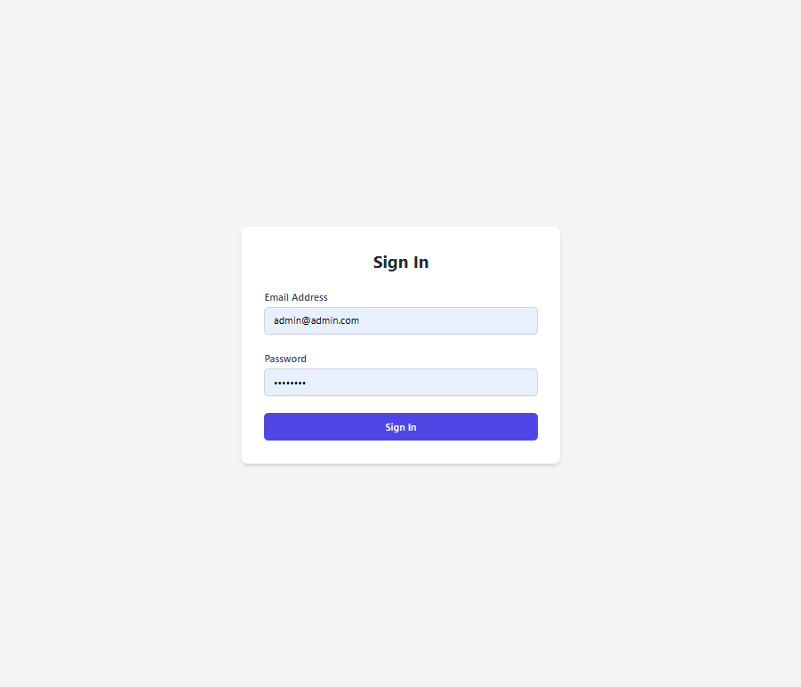
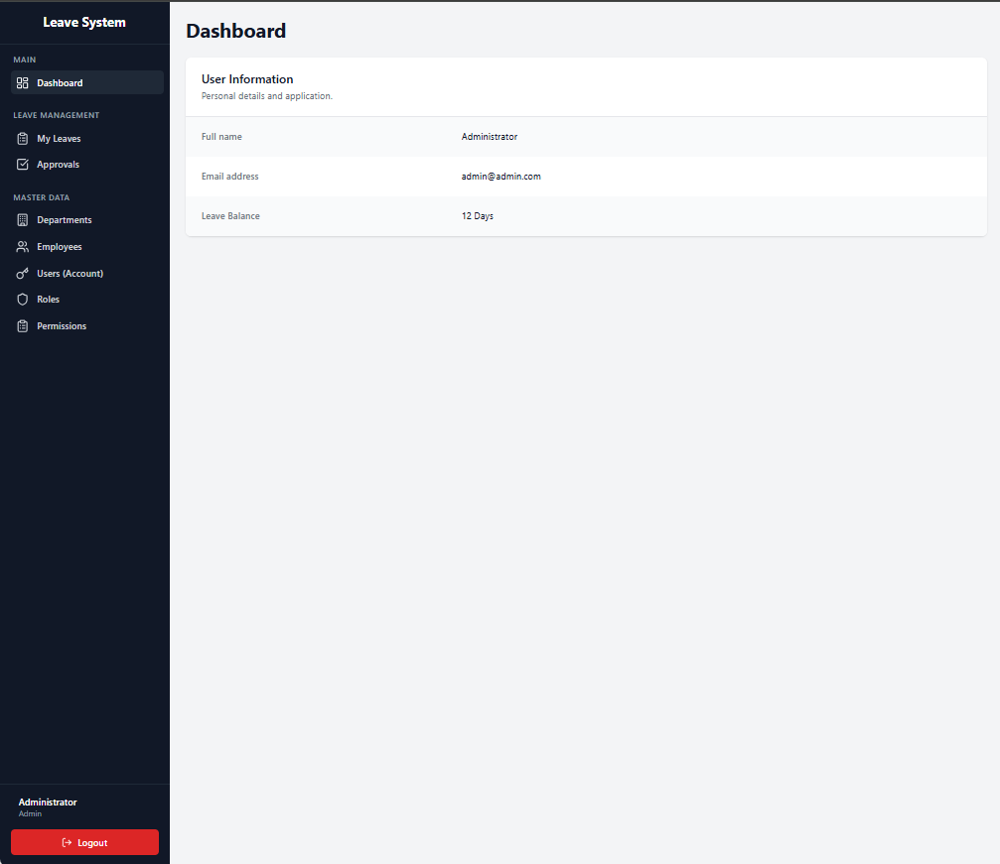
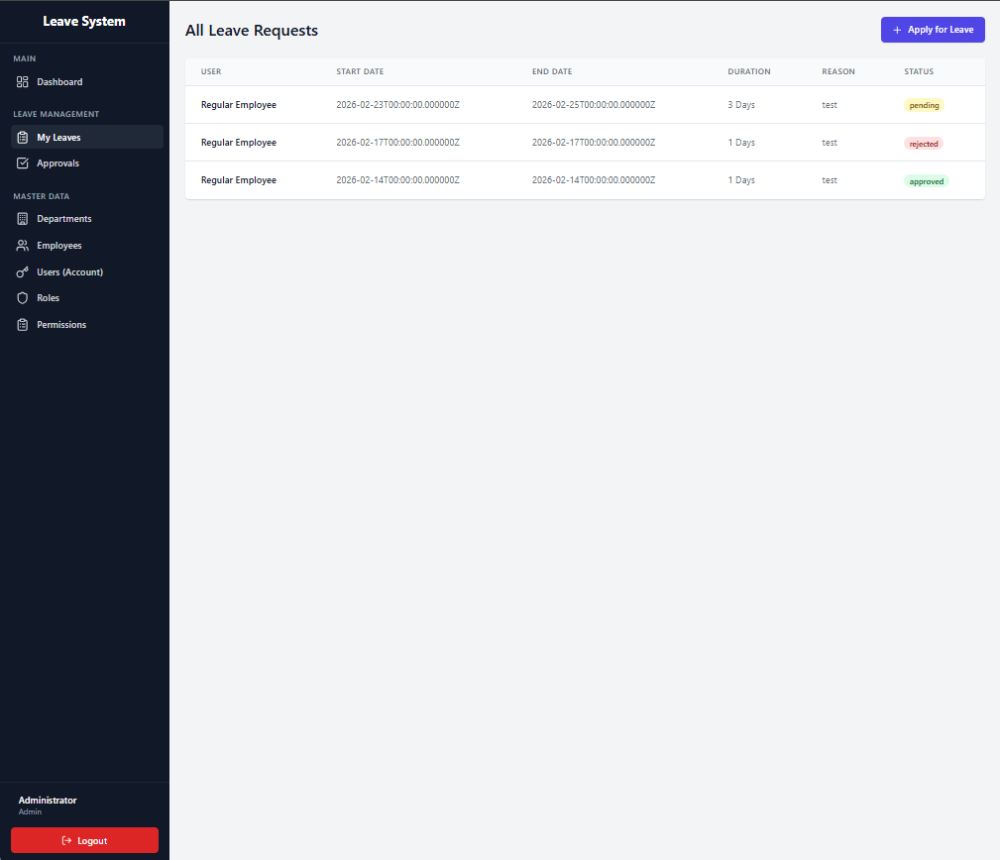
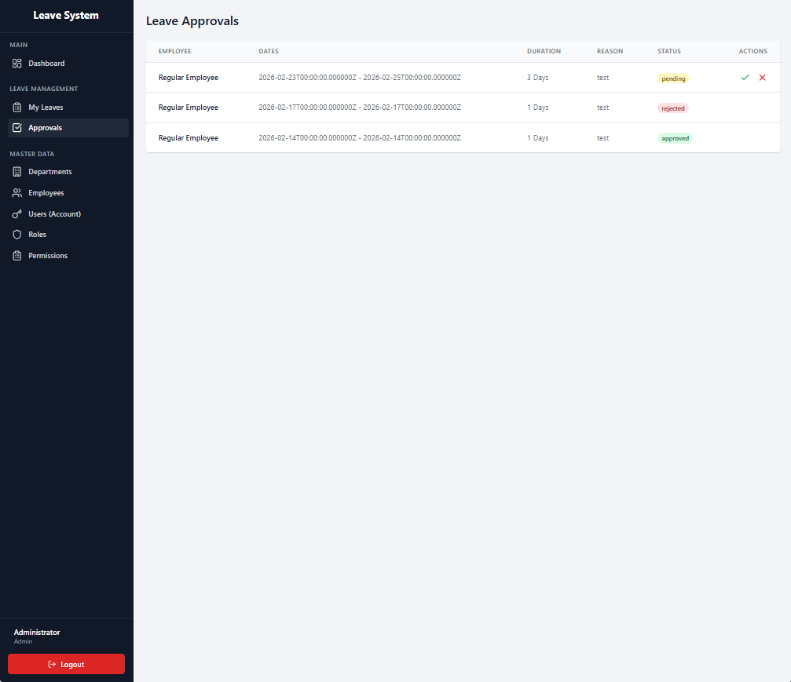
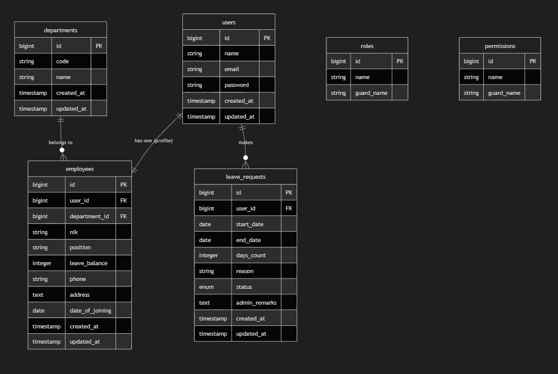

# Sistem Manajemen Pengajuan Cuti

Aplikasi full-stack untuk mengelola pengajuan cuti karyawan, dibangun dengan Laravel 12 dan React 19.

[📘 **Baca Studi Kasus Lengkap**](./STUDI_KASUS.md)

## Persyaratan Sistem

Sebelum menginstal, pastikan komputer Anda memenuhi persyaratan berikut:

- **PHP**: Versi 8.2 atau lebih tinggi
- **Composer**: Untuk mengelola dependensi PHP
- **Node.js & NPM**: Untuk mengelola dependensi frontend
- **Database**: MySQL, PostgreSQL, atau SQLite

## Teknologi yang Digunakan

- **Backend**: Laravel Framework 12.x
- **Frontend**: React 19, TypeScript, Vite
- **Styling**: Tailwind CSS
- **Autentikasi**: Laravel Sanctum (Token-based)
- **Ikon**: Lucide React
- **Database**: MySQL/MariaDB (Disarankan)

---

## Cara Instalasi

Ikuti langkah-langkah berikut untuk mengatur proyek di komputer lokal Anda:

1.  **Clone Repository**

    ```bash
    git clone <repository-url>
    cd project-test
    ```

2.  **Setup Backend**
    - Instal dependensi PHP:
        ```bash
        composer install
        ```
    - Buat file environment:
        ```bash
        cp .env.example .env
        ```
    - **Konfigurasi Database**: Buka file `.env` dan perbarui pengaturan `DB_` (DB_DATABASE, DB_USERNAME, DB_PASSWORD).
    - Generate Application Key:
        ```bash
        php artisan key:generate
        ```
    - Jalankan Migrasi Database:
        ```bash
        php artisan migrate
        ```
    - **Seeding Database** (Penting untuk membuat User & Role awal):
        ```bash
        php artisan db:seed --class=RolePermissionSeeder
        ```

3.  **Setup Frontend**
    - Instal dependensi Node:
        ```bash
        npm install
        ```
    - Build aset (opsional jika menjalankan dev server):
        ```bash
        npm run build
        ```

---

## Cara Menjalankan Aplikasi

Anda dapat menjalankan server backend dan frontend secara bersamaan menggunakan perintah composer yang telah dikonfigurasi:

```bash
composer run dev
```

Atau, Anda dapat menjalankannya di terminal terpisah:

1.  **Terminal 1 (Backend)**:
    ```bash
    php artisan serve
    ```
2.  **Terminal 2 (Frontend)**:
    ```bash
    npm run dev
    ```

Buka browser Anda dan akses: `http://localhost:8000`

---

## Informasi Akun Login

Aplikasi ini dilengkapi dengan akun bawaan yang memiliki peran berbeda:

### 1. Administrator

Memiliki akses penuh ke semua menu (Dashboard, My Leaves, Approvals, Master Data).

- **Email**: `admin@example.com`
- **Password**: `password`

### 2. Karyawan Biasa

Memiliki akses terbatas (Dashboard, My Leaves).

- **Email**: `employee@example.com`
- **Password**: `password`

---

## Fitur Utama

1.  **Autentikasi**: Login aman dengan batas waktu sesi (2 jam tidak aktif).
2.  **Kontrol Akses Berbasis Peran (RBAC)**:
    - Admin: Mengelola Departemen, User, Role, Permission. Menyetujui/Menolak cuti.
    - Karyawan: Mengajukan cuti, melihat riwayat sendiri.
3.  **Manajemen Cuti**:
    - Pengajuan cuti dengan validasi rentang tanggal.
    - Alur persetujuan Admin dengan konfirmasi **SweetAlert2**.
    - Admin melihat kolom "User" di daftar; User hanya melihat data sendiri.
    - Validasi saldo cuti secara real-time.
4.  **Master Data**: Operasi CRUD (Buat, Baca, Ubah, Hapus) untuk Departemen, User, Role, dan Permission.

---

## Screenshot Sistem

_(Screenshots diambil dari folder `document/`)_

### 1. Halaman Login



### 2. Dashboard



### 3. My Leaves (Menu Cuti)



### 4. Menu Approval (Persetujuan)



---

## Dokumentasi API Lengkap

Berikut adalah daftar endpoint API yang tersedia di aplikasi ini.

### Autentikasi

#### 1. Login

- **URL**: `/api/v1/auth/login`
- **Method**: `POST`
- **Body**:
    ```json
    {
        "email": "admin@example.com",
        "password": "password"
    }
    ```
- **Response (200 OK)**:
    ```json
    {
        "message": "Logged in",
        "user": { ... },
        "token": "1|laravel_sanctum_token..."
    }
    ```

#### 2. Get User Profile

- **URL**: `/api/v1/auth/me`
- **Method**: `GET`
- **Headers**: `Authorization: Bearer <token>`
- **Response (200 OK)**: Mengembalikan data user yang sedang login beserta role dan permission.

#### 3. Logout

- **URL**: `/api/v1/auth/logout`
- **Method**: `POST`
- **Headers**: `Authorization: Bearer <token>`

### Manajemen Cuti (Leaves)

#### 1. List Cuti

- **URL**: `/api/v1/leaves`
- **Method**: `GET`
- **Headers**: `Authorization: Bearer <token>`
- **Query Params**: `?scope=all` (Opsional, untuk Admin melihat semua)
- **Response**: Daftar pengajuan cuti.

#### 2. Ajukan Cuti

- **URL**: `/api/v1/leaves`
- **Method**: `POST`
- **Headers**: `Authorization: Bearer <token>`
- **Body**:
    ```json
    {
        "start_date": "2026-03-01",
        "end_date": "2026-03-03",
        "reason": "Sakit"
    }
    ```

#### 3. Approval Cuti (Admin)

- **URL**: `/api/v1/leaves/{id}/approval`
- **Method**: `PUT`
- **Headers**: `Authorization: Bearer <token>`
- **Body**:
    ```json
    {
        "status": "approved" // atau "rejected"
    }
    ```

---

## Struktur Database & Diagram Relasi (ERD)

Berikut adalah struktur tabel dan relasi antar tabel dalam database.

### Diagram Relasi Entitas (ERD)



### Definisi Tabel (DDL Ringkas)

1.  **users**: Menyimpan data login karyawan, saldo cuti (`leave_balance`), dan relasi ke departemen (`department_id`).
2.  **departments**: Data master departemen (Code, Name).
3.  **leave_requests**: Transaksi pengajuan cuti. Menyimpan `start_date`, `end_date`, `status` (pending/approved/rejected), dan `days_count`.
4.  **roles & permissions**: Tabel bawaan dari _spatie/laravel-permission_ untuk manajemen hak akses.
